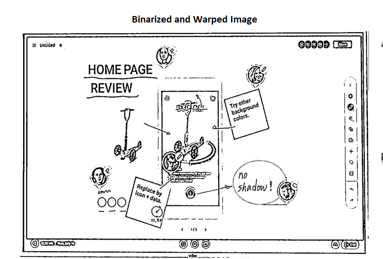
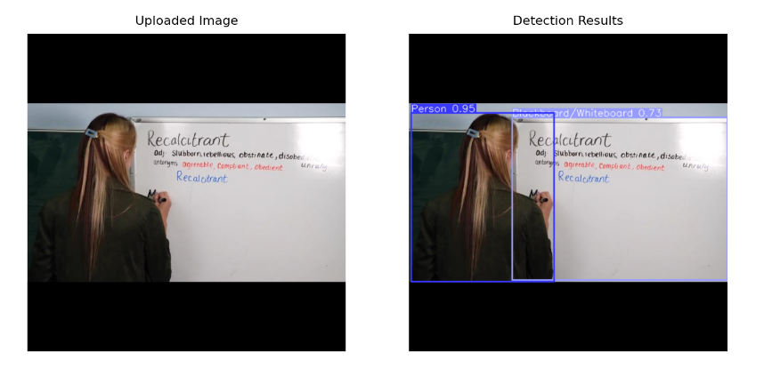
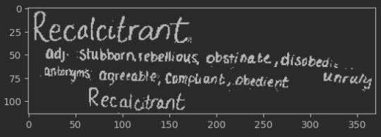

# Whiteboard Detection and Text Identification

For quick testing of the app, visit this [link](https://sabaina-haroon-whiteboard-detection-and-text-i-inference-jiy28u.streamlitapp.com/)


# Installation Guide
<a name="TOP"></a>

### 1. Install Tesseract 
<a name="TOP"></a>
- <b> <span style="color: Green; "> Ubuntu </span> </b>
       
You can install Tesseract and its developer tools on Ubuntu by simply running:
    
    
        sudo apt install tesseract-ocr
        sudo apt install libtesseract-dev
Note for Ubuntu users: In case apt is unable to find the package try adding universe entry to the sources.list file as shown below.


    sudo vi /etc/apt/sources.list

    Copy the first line "deb http://archive.ubuntu.com/ubuntu bionic main" and paste it as shown below on the next line.
    If you are using a different release of ubuntu, then replace bionic with the respective release name.

    deb http://archive.ubuntu.com/ubuntu bionic universe

<a name="TOP"></a>
- <b> <span style="color: Green; "> Windows </span> </b>
        
Installer for Windows for Tesseract 3.05, Tesseract 4 and Tesseract 5 are available from <a href="https://github.com/UB-Mannheim/tesseract/wiki" target="https://github.com/UB-Mannheim/tesseract/wiki">Tesseract at UB Mannheim</a> . These include the training tools. Both 32-bit and 64-bit installers are available.
    
Once the installer is downloaded and installed, add the directory where the tesseract-OCR binaries are located to the Path variables. Default directory for tesseract is 

    C:\Program Files\Tesseract-OCR.

### 2. Install Dependencies 

Clone repo and install [requirements.txt](https://github.com/sabaina-Haroon/whiteboard_detection_and_text_identification/blob/main/requirements.txt) in a
[**Python>=3.7.0**](https://www.python.org/) environment, including
[**PyTorch>=1.7**](https://pytorch.org/get-started/locally/).

```bash
git clone https://github.com/sabaina-Haroon/whiteboard_detection_and_text_identification  # clone
pip install -r requirements.txt  # install
```

### 3. Run the App 
In the terminal, type command;

    streamlit run inference.py


# How it works
<a name="TOP"></a>

<b> <span style="color: Green; "> Pipeline </span> </b>

1. App allows user to upload Image from local Drive
2. Uploaded Image is fed to yolov5 detection custom model trained on Object365 dataset.
3. Detected regions are cropped and individually are fed to text extraction pipeline
4. Text Extraction pipeline consists of three options, EasyOCR , Pytesseract and Ensemble of both methods


<b> <span style="color: Green; "> Limitations </span> </b>


This app has multiple limitations due to time constraint of implementation. These limitations can be promising next steps for further exploration.

-   Prebuilt OCR models for instance the ones used in this app, work well with typed fonts but struggle hard for detection on handwritten texts. Whiteboard images would mostly consist of handwritten text, which gets very hard for the app to identify. 
- EasyOCR performs well compared to pytesseract but it is computationally expensive and currently for the app it only works for englsh language, keeping in mind resource limit for deployment.
- Pytesseract is light-weight for deployment, but struggles with lightening conditions in which image is taken and greatly depends upon the preprocessing steps applied to the input image.

<b> <span style="color: Green; "> Looking forward </span> </b>

Specific to whiteboard detection , it could be beneficial to gather handwritten dataset based on <b>alphabets</b> of multiple languages, and train model individually for all the characters. 
Spacial Transformer models can be trained and make part of the pipeline for further improvements. 

# Insights
<a name="TOP"></a>

<b> <span style="color: Green; "> Example Image for CV2 Warping applied on input image to pytesseract </span> </b>




<b> <span style="color: Green; "> Example of Pytesseract Result on Full Image </span> </b>



### Output from EasyOCR
"Recalcitrant adj;' 'Stubborn lebellious obstinate, disobedtens , anbnjns; agrecable; Compl; ali Obadient: unwty Recaittrant:"

### Output from pytesseract 
=} Recalectrant,
i ddj- Stubborn. sebetious, obstinate , disobea,.

Antonyms, agreeable, Compliant, obedient Unruly

Recaigitvant

### Output when Image cropped from easyOCR boundingbox is fed to Pytesseract



Recalcitrant,

Adj: ‘Stubborn sebelious, obstinate , disobedi.

Antonyms: agreeable; Compliant, obedient

Unruly

Recalcitrant


